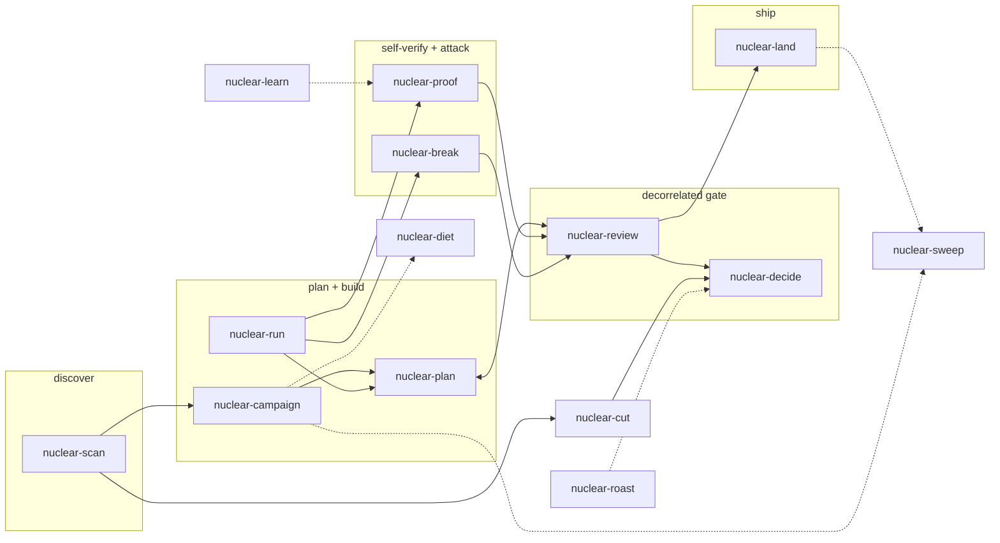

# askrubberduck skills

Portable process skills mined from real agent sessions: decorrelated review gates, plan
co-authoring, backlog scans, git hygiene, decision facilitation. No repo-specific paths — each
skill detects the host repo's registries (STATUS/OBLIGATIONS/backlog docs) or asks once.

## Install

### Claude Code

```
/plugin marketplace add askrubberduck/skills
/plugin install askrubberduck@askrubberduck
```

Or symlink for local use:

```bash
mkdir -p ~/.claude/skills
ln -s "$(pwd)/skills/"* ~/.claude/skills/
```

Start a new Claude Code session after installing so it refreshes skill discovery.

### Codex CLI and the Codex app (recommended)

Install the repository as a plugin. This keeps the full collection versioned as one unit and is the
recommended distribution path for Codex:

```bash
codex plugin marketplace add askrubberduck/skills
codex plugin add askrubberduck@askrubberduck
codex plugin list
```

For a reproducible install after the release tag exists, pin the marketplace checkout:

```bash
codex plugin marketplace add askrubberduck/skills --ref v0.3.0
codex plugin add askrubberduck@askrubberduck
```

Use signed release tags when stability matters. Start a new Codex session after installation. Plugin
skill names are qualified, for example `$askrubberduck:nuclear-run`.

### Codex IDE and standalone Agent Skills

For hosts that support Agent Skills but not Codex plugins, install the canonical `skills/` directories
into the cross-runtime discovery path:

```bash
git clone https://github.com/askrubberduck/skills askrubberduck-skills
mkdir -p ~/.agents/skills
ln -s "$PWD"/askrubberduck-skills/skills/* ~/.agents/skills/
```

Start a new Codex session after linking. Standalone names are unqualified, for example
`$nuclear-run`. Do not install both the plugin and standalone links in the same Codex profile unless
you intentionally want duplicate skill entries.

The canonical cross-skill reference is `$askrubberduck:<name>`. Codex uses that form literally;
other agents should retain the `askrubberduck:` namespace and translate only the invocation syntax
their host exposes. Use `$<name>` or `<name>` only for a deliberate standalone install. A referenced
skill must resolve before its step begins, or the workflow fails closed instead of silently skipping
its gate.

### Agents without native skill discovery

Paste the block from [`AGENTS-CATALOG.md`](AGENTS-CATALOG.md) into the repo's `AGENTS.md` — any
agent that can read files will then load the right `SKILL.md` on demand.

## Works well with

None of these are required — the collection is self-contained — but they compound it:

- **[ponytail](https://github.com/DietrichGebert/ponytail)** — lazy-senior-dev mode; `nuclear-run`
  invokes its simplification lens by name, and the whole family shares its cut-before-add soul.
- **[caveman](https://github.com/JuliusBrussee/caveman)** — terse-prose mode; pairs with
  `nuclear-diet`'s token discipline (diet cuts payloads, caveman cuts prose).
- **[rtk](https://www.rtk-ai.app/)** — hook-level CLI proxy that shrinks dev-command output before
  it reaches the context; the runtime complement to `nuclear-diet`'s rules.

Hard prerequisites are only `git` + `gh`, and at least one reviewer CLI whose self-reported model
family differs from the doer (for example Gemini when the doer is OpenAI/GPT, or Codex when the doer
is not OpenAI/GPT). Without a proven decorrelated family, `nuclear-review` fails closed by design.

## The graph



Solid arrows: the delivery pipeline (discover → plan/build → verify/attack → gate → ship).
Dotted: supporting handoffs. `nuclear-roast` critiques the whole standing solution,
`nuclear-learn` feeds session lessons back into skills and memory, `nuclear-diet` keeps every
stage cheap.

## Skills

<!-- skills-table:start -->
| Skill | Use when |
|---|---|
| `nuclear-break` | a build claims done and needs breaking — "try to break it", "nuclear break" — or when trust-touching work needs dynamic evidence before its review gate; also when a green test suite is the only proof a change works |
| `nuclear-campaign` | the user asks to start a campaign, "take all plannable work and execute", turn vision/backlog/competitor gaps into parallel builds, or hands one broad directive that implies many work items — and no campaign structure exists yet |
| `nuclear-cut` | the user asks to reduce work scope, critique or clean the backlog, "run critique on every open but blocked task", "finish all possible items autonomously", or the open/blocked/deferred item count keeps growing |
| `nuclear-decide` | open decisions, blocked obligations, or sign-offs need the owner's answer — "walk me through the decisions", "talk me through each", "one by one with options" — or when more than one owner decision is pending at once |
| `nuclear-diet` | the user says "min tokens", asks why sessions are expensive, wants an agent setup health-check or CLAUDE.md/AGENTS.md/memory trim, before starting a campaign or multi-agent run, or when a session has crossed days/compactions — any context or token cost needing audit or prevention |
| `nuclear-land` | a change has passed its review gate and needs merging plus outcome recording — "land it", "merge and record", a gate-passed PR is ready — or when merged work was never recorded in the repo's truth docs |
| `nuclear-learn` | asked to mine sessions or outcomes for lessons, extract skills from repeated workflows, "what should become a skill", "what wasted tokens", or for a retro after a campaign, incident, or many-round review gate |
| `nuclear-plan` | about to plan or implement packet-sized, architectural, or trust-touching work — a plan or draft exists or is about to be written — or when past review gates for similar work took many REJECT rounds |
| `nuclear-proof` | Force a skeptical second pass on your own work |
| `nuclear-review` | a PR, diff, packet, or trust-touching change hits its review gate, or the user says "redteam", "decorrelated review", or "codex+agy review" |
| `nuclear-roast` | the user asks for a "roast", a full critique of the whole product, solution, or architecture from multiple angles, says "run and run again", or wants a milestone-level adversarial read — solution-scoped, not a change review or backlog sweep |
| `nuclear-run` | Full-rigor delivery loop — detailed plan, adversarial critique/red-team of the plan, execute on green with host-native orchestration, ponytail simplification lens, and verification before claiming done |
| `nuclear-scan` | the user asks "what's next", "what's open for me", "what can be picked up", "status?", "what's left", or pings readiness of named work items ("B28 ready? X ready?") — any read-only backlog question |
| `nuclear-sweep` | the user asks to clean up branches, worktrees, stale checkouts, temp/scratch dirs, or .gitignore across one or more repos, or when stale worktrees accumulate after merged work |
<!-- skills-table:end -->

Generated from skill frontmatter — edit descriptions in `skills/<name>/SKILL.md`, then run
`python3 scripts/render-catalog.py`.

## Release validation

Before publishing or tagging a release, run the deterministic distribution checks from the repository
root:

```bash
python3 scripts/render-catalog.py --check
python3 scripts/validate-distribution.py --self-test
```

The validator checks both host manifests, the Codex marketplace source, the canonical 14-skill set,
cross-skill resolution, install documentation, generated catalog freshness, and known corruption
cases. It performs no network access and writes only to temporary directories during self-test.

## The soul — carried by every skill

- **The doer is never the final judge** — every gate is decorrelated; a self-pass earns the
  dispatch, never the approval.
- **Evidence over assertion** — a claim without output is not done; an empty result is never success.
- **Cut before add** — every finding list treats "delete this" as first-class; every sweep's product
  is deletions.
- **Absolute paths, no `cd` chains** — path boilerplate was the #2 token sink in the sessions these
  skills came from.
- **Grep-first, delegate large reads** — no >20KB file pulls into the main context; page with
  offset/limit or send an investigator subagent.
- **Never commit raw CLI stdout** — extract verdicts/findings; raw outputs stay in the scratchpad.
- **End the session at stage boundaries** — plan→build→review transitions are compaction points;
  marathon sessions re-bill the whole window every turn.
- **Fail closed** — a missing reviewer, empty output, or unverified claim is never an implicit pass.

## Credits

`nuclear-proof` adapts Josh Pigford's (Shpigford) "but-for-real" skill; author retained in its
frontmatter metadata.

## Status

v0.3.0 — first-class Codex plugin and marketplace distribution, with the canonical
`$askrubberduck:<name>` namespace carried across hosts. Codex uses the reference literally; other
Agent Skills hosts retain `askrubberduck:` while translating only their invocation syntax. Bare
cross-skill references now fail deterministic validation.

The 14-skill collection remains compatible with Claude Code plugin installs, Codex plugin installs,
and deliberate standalone Agent Skills installs. Host-native orchestration and Claude/Codex session
stores are documented and validated.
