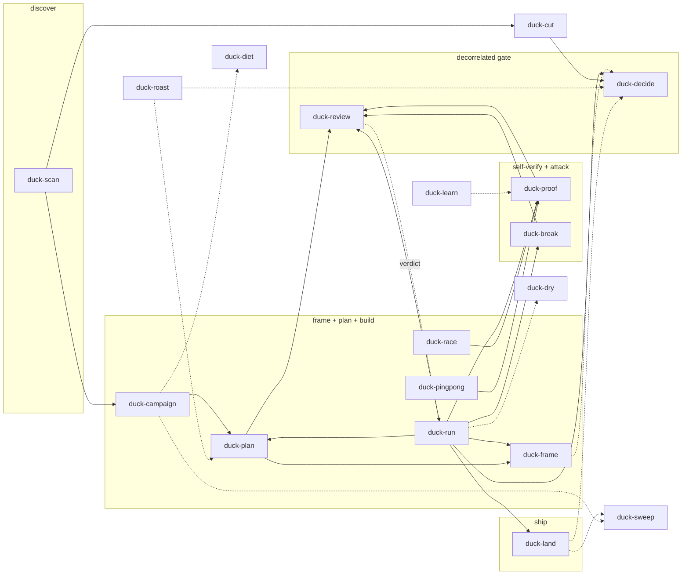

# askrubberduck skills

Ask the duck. The duck is cynical, sarcastic, dry, and straightforward — it listens to your
plan, assumes it is wrong somewhere, and makes you prove otherwise. Portable process skills mined
from real agent sessions: decorrelated review gates, plan co-authoring, backlog scans, git
hygiene, decision facilitation. No repo-specific paths — each
skill detects the host repo's registries (STATUS/OBLIGATIONS/backlog docs) or asks once. Once.

## Install

### Claude Code

```
/plugin marketplace add askrubberduck/skills
/plugin install askrubberduck@askrubberduck
```

Or symlink for local use:

```bash
mkdir -p ~/.claude/skills
ln -s "$(pwd)/skills/"* ~/.claude/skills/
```

Start a new Claude Code session after installing — hosts read skills at startup, not at the
moment you start wishing they had.
Plugin skills are namespaced slash commands, for example `/askrubberduck:duck-run`. The local
symlink install is standalone and therefore exposes `/duck-run` instead.

#### Cloud sessions

Both installs above are invisible to a cloud session — Claude Code on the web, `claude --cloud`, and
routines run in a fresh container that clones the repo and never reads `~/.claude/`. The duck does not follow
you to the cloud; the repo carries it there. A cloud session loads project skills from the cloned
`.claude/skills/`, so this repo links its own skills there:
open a cloud session on this repo and `/duck-cut` works with no setup, resolved from the checked
out branch rather than the published release. `validate-distribution.py` fails if a skill in
`skills/` has no link, because a missing one is silent — and silent is how skills die.

To get the skills in a **different** repo's cloud sessions, declare the plugin in that repo's
`.claude/settings.json`. Repo-declared plugins install at session start; plugins enabled only in
your user settings do not transfer:

```json
{
  "extraKnownMarketplaces": {
    "askrubberduck": { "source": { "source": "github", "repo": "askrubberduck/skills" } }
  },
  "enabledPlugins": { "askrubberduck@askrubberduck": true }
}
```

That form installs the published default branch, needs network access to GitHub, and exposes the
namespaced `/askrubberduck:duck-run`. The third route is enabling the skills on your claude.ai
account, which is the only one that also reaches Cowork sessions; those uploads accept only the six
Agent Skills frontmatter fields, which every skill here already satisfies — the duck travels
light.


### Codex CLI and the Codex app (recommended)

Install the repository as a plugin. This keeps the full collection versioned as one unit,
which is the point of a collection:

```bash
codex plugin marketplace add askrubberduck/skills
codex plugin add askrubberduck@askrubberduck
codex plugin list
```

For a reproducible install, resolve and pin the latest published release rather than following
`master` — "latest" is a moving target, and moving targets are how surprises ship:

```bash
release_tag="$(gh release view --repo askrubberduck/skills --json tagName --jq .tagName)"
codex plugin marketplace add askrubberduck/skills --ref "$release_tag"
codex plugin add askrubberduck@askrubberduck
```

Start a new Codex session after installation. Plugin skill names are qualified, for example
`$askrubberduck:duck-run`.

### Agy

Agy can install the same canonical tree as a native plugin through the root `plugin.json` adapter:

```bash
git clone https://github.com/askrubberduck/skills askrubberduck-skills
agy plugin validate ./askrubberduck-skills
agy plugin install ./askrubberduck-skills
agy plugin list
```

Start Agy and invoke `/duck-run <task>`. If Agy qualifies the command to avoid a collision, select
the `/askrubberduck:duck-run` form shown by its command picker.

### Standalone Agent Skills

For Codex IDE, Agy, Cursor, Copilot, and other hosts that support Agent Skills but not this repository's
plugin format, install the canonical `skills/` directories into the cross-runtime discovery path:

```bash
git clone https://github.com/askrubberduck/skills askrubberduck-skills
mkdir -p ~/.agents/skills
ln -s "$PWD"/askrubberduck-skills/skills/* ~/.agents/skills/
```

Start a new host session after linking. Standalone names are unqualified: Codex commonly exposes
`$duck-run`, while Claude and Agy expose `/duck-run`; other clients may use a picker or another
invocation syntax. Do not install both a plugin and standalone links in the same host profile unless
you enjoy explaining duplicate skill entries to yourself later.

The table below is about **what a person types**. Inside skill bodies, one skill refers to another by
its bare frontmatter name (`duck-proof`) — the one name every host lists, and the only one that
resolves on a standalone install. A namespaced literal in a body hard-fails there
(`Unknown skill: askrubberduck:duck-proof`), and `validate-distribution.py` rejects both a
namespaced reference and one naming a skill that does not exist.

| Installation | User invocation | Description source |
|---|---|---|
| Codex plugin | `$askrubberduck:duck-run` | `agents/openai.yaml`, with `SKILL.md` for triggering |
| Claude plugin | `/askrubberduck:duck-run` | `SKILL.md` |
| Agy plugin | `/duck-run`; namespaced only when needed | `SKILL.md` |
| Standalone Agent Skills | Unqualified, using the host's syntax | `SKILL.md` |

### Updating an existing install

New skills added after you installed are **not** picked up automatically — nothing here updates
itself, and the duck considers that a feature. The symlink form links each skill individually, so a `git pull` that adds one leaves it invisible until you relink:

```bash
git -C askrubberduck-skills pull
ln -sfn "$PWD"/askrubberduck-skills/skills/* ~/.claude/skills/    # or ~/.agents/skills/
```

Plugin installs update through their host instead — `codex plugin marketplace upgrade` for Codex,
`/plugin` for Claude Code, `agy plugin install` again for Agy. Start a new session afterwards either
way; hosts read the skill set at startup.

### Agents without native skill discovery

Paste the block from [`AGENTS-CATALOG.md`](AGENTS-CATALOG.md) into the repo's `AGENTS.md` — any
agent that can read files will then load the right `SKILL.md` on demand. Reading files is the one
capability the duck assumes.

## Works well with

None of these are required — the collection is self-contained — but they compound it:

- **[ponytail](https://github.com/DietrichGebert/ponytail)** — lazy-senior-dev mode; `duck-run`
  invokes its simplification lens by name, and the whole family shares its cut-before-add soul.
- **[caveman](https://github.com/JuliusBrussee/caveman)** — terse-prose mode; pairs with
  `duck-diet`'s token discipline (diet cuts payloads, caveman cuts prose).
- **[rtk](https://www.rtk-ai.app/)** — hook-level CLI proxy that shrinks dev-command output before
  it reaches the context; the runtime complement to `duck-diet`'s rules.

Hard prerequisites are `git` + `gh`, and **two reviewer CLIs from two different model families**,
at least one proven different from the doer — that is the quorum `duck-review` enforces, not one.
For example Gemini and Codex when the doer is Claude. A machine with a single reviewer satisfies
neither the gate nor this list: without a proven decorrelated family, `duck-review` fails closed
by design. Executable names are not identities; pin the model and verify what it reports — the duck has
been lied to before.

## The graph



Solid arrows: the delivery pipeline (discover → frame/plan/build → verify/attack → gate → ship).
`duck-frame` owns everything before planning — the seam map, the requirements, the rejected
alternatives — and hands its artifact back to whoever called it; it never advances a stage itself.
The review-to-run verdict is a return, not an approval loop: `duck-review` judges once;
`duck-run` may remediate and request a new review only for a materially changed candidate.
Other dotted arrows are supporting handoffs. **The graph is a subset drawn for orientation, not a
map of every edge** — several real handoffs are omitted to keep it readable, and it is maintained by
hand. Where it disagrees with the skill bodies, the bodies are authoritative.
`duck-roast` critiques the whole standing solution,
`duck-learn` feeds session lessons back into skills and memory, `duck-diet` keeps every
stage cheap, and `duck-dry` keeps the prose inside the code load-bearing.

## Skills

<!-- skills-table:start -->
| Skill | What it does |
|---|---|
| `duck-break` | Attack a 'finished' build to find out how finished it actually is |
| `duck-campaign` | Carve a grand vision into prioritized workstreams that can ship without waiting on each other |
| `duck-cut` | Shrink a backlog the honest way — obsolete work out, duplicates merged, viable items unblocked |
| `duck-decide` | Walk the owner through the decisions they have been ducking, one at a time |
| `duck-diet` | Put agent context, memory, and token costs on a diet without starving the essential guidance |
| `duck-dry` | Strip comment and docstring noise until only unobvious decisions, contracts, and traps survive |
| `duck-frame` | Settle a system's target design before planning begins, because 'we'll figure out the architecture later' means never |
| `duck-land` | Merge approved work, update project records, and clean up the branch and worktree; landed means nothing left behind |
| `duck-learn` | Turn session and delivery evidence into reusable lessons, so each mistake is only paid for once |
| `duck-pingpong` | Alternate test-writing and implementation between two decorrelated model families that don't trust each other, one failing test per rally |
| `duck-plan` | Catch architectural and implementation risks before the code catches them for you |
| `duck-proof` | Give 'completed' work a skeptical second pass before anyone trusts it; 'it should work' is not evidence |
| `duck-race` | Race two decorrelated model families against the same frozen problem and let executed evidence pick the winner |
| `duck-review` | Run one independent cross-model superreview and deliver an evidence-backed APPROVE, REJECT, or NOTE; no participation trophies |
| `duck-roast` | Roast an entire product, solution, or architecture from every angle until only the defensible parts remain |
| `duck-run` | Plan, implement, test, and independently review a high-risk change; trust is not part of the pipeline |
| `duck-scan` | Find ready, blocked, and remaining work without changing anything; looking is free |
| `duck-sweep` | Clean out stale branches, worktrees, checkouts, scratch directories, and ignore rules; the pond stays clean |
<!-- skills-table:end -->

The README uses each frontmatter description's first sentence; `AGENTS-CATALOG.md` keeps the full
capability-and-trigger description. Codex UI copy lives in `skills/<name>/agents/openai.yaml`.
After editing frontmatter, run `python3 scripts/render-catalog.py`.

## Release validation

Before publishing or tagging a release, run the deterministic distribution checks from the repository
root:

```bash
python3 scripts/render-catalog.py --check
python3 scripts/validate-distribution.py --self-test
```

The validator checks the Codex, Claude, and Agy manifests; every Codex skill interface; the
canonical skill set; human-first, YAML-safe descriptions; cross-skill resolution; install
documentation; generated catalog freshness; and known corruption cases. It performs no network
access and writes only to temporary directories during self-test. It has rejected this
collection's own releases, which is exactly the job.

## The soul — carried by every skill

The duck's temperament — cynical, sarcastic, dry, straightforward — is not decoration; it is the
review posture. Every rule below is that temperament applied:

- **The doer is never the final judge** — every gate is decorrelated; a self-pass earns the
  dispatch, never the approval.
- **Evidence over assertion** — a claim without output is not done; an empty result is never success.
- **Sceptical by default** — a reviewer finding is adjudicated against source, your own fix is
  re-attacked, a built-in is trusted only for what it provably guarantees. The deadliest loop is
  *obedient* patching: every round of "harden the wheel you invented" feels like progress, and the
  only exit is the question no reviewer will ask for you — should this wheel exist at all?
- **The most reliable code is the code never written** — the first move on any finding is "would
  deleting this end it?", not "how do I patch it". Reach for the boring version first, then prove
  what it actually promises; a built-in's guarantee is routinely narrower than its name.
- **Cut before add** — every finding list treats "delete this" as first-class; every sweep's product
  is deletions. A fix pass that only grows is not progress.
- **Concepts, not lines** — line count is a smell, never a target. What compounds is how many things
  a reader must hold, whether one path traces without jumping, whether cause sits near effect.
- **A rule states what must hold, not how it was learned** — the incident that produced a rule is
  not the rule, and belongs in the release notes.
- **Token discipline** — absolute paths, grep-first, raw output out of git, sessions end at stage
  boundaries; the runtime rules live in `duck-diet`.
- **Fail closed** — a missing reviewer, empty output, or unverified claim is never an implicit pass.

## Credits

`duck-proof` began as an adaptation of Josh Pigford's (Shpigford) "but-for-real" skill. It has
since been rewritten and no longer carries his text; the section arc is the surviving debt.

## Status

v1.0.0 — 18 skills, one duck. Per-version notes live in
[Releases](https://github.com/askrubberduck/skills/releases).

Every rule in these skills is here because something measurably failed without it, mined from real
session transcripts rather than imagined failure modes. `scripts/validate-distribution.py --self-test`
enforces the load-bearing ones and must pass before a change lands. The duck does not trust this
README either; that is what the validator is for.
