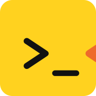

<p align="center">
  
</p>

# askrubberduck

**Agent Skills that make the work prove itself.**

For Claude Code, Codex, Cursor, Copilot, and any host that reads Agent Skills. MIT.

Rubber duck debugging works because the duck says nothing. You explain the bug line by line, and
somewhere around the fourth line you hear it yourself.

Your coding agent has no duck. When it says the change is done, who checked?

These skills are the duck. They do not make the model smarter. They put a second stage after every
claim, and that stage does not take the first one's word for it. A different model family holds the
gate. Every finding carries the evidence that produced it. The decisions that are yours come back
as decisions, never as defaults.

## What the duck holds to

Four rules. Every skill here is one of them, applied somewhere specific.

**The duck doesn't judge.** It measures. A gate returns `APPROVE`, `REJECT`, or `NOTE` on evidence a
third party can re-check, never on taste, and each verdict cites the artifact that earned it. A
break run and a roast return every finding, unranked, because weight is yours to assign. A choice
that belongs to you ends the stage as `OWNER DECISION`, never as a guess made on your behalf.

**The duck doesn't repeat.** One home per fact. A comment that restates the line under it is
deleted. A commit message carries only what the diff cannot. An unchanged candidate is never
reviewed twice, and a decision already in the log is never asked again.

**The duck listens.** It reads before it speaks, and says where it read: a file and line, a document
at the version the project pins, or a command and what it printed. `duck-scan` reads and changes
nothing. `duck-why` reproduces the failure before it names the cause. The skills that find
problems, `duck-why`, `duck-break`, `duck-review`, and `duck-roast`, hand them on; none of them
fixes.

**The duck helps you think deeper, so the answer is yours.** Questions come before fixes. Would
deleting this end the finding? What outcome dies if this is never built? What is the second case for
this seam? What did the command print? The fix then travels the normal path, in your hands, past a
reviewer that is not its author.

## Say it to the duck

Install once, then talk to your agent as usual. The descriptions do the routing.

| You say | What comes back |
|---|---|
| "duck it" | `duck-run`: the change landed, or the ask reconciled item by item with what stopped it. |
| "why is this broken?" | `duck-why`: the reproducing command, the cause in one sentence, and where the fix belongs. No fix. |
| "gate it" | `duck-review`: one verdict, each reviewer's family named, every finding with its evidence. |
| "try to break it" | `duck-break`: the attack list, each attack with the command run and what it printed. |
| "dry it" | `duck-dry`: the diff, a mechanical check that only comments changed, and the gates run green. |
| "what's next?" | `duck-scan`: one table of item, state, blocked on, pickable, then one sentence of advice. |
| "race it" | `duck-race`: the winning diff, both test outputs, and where the two attempts disagreed. |
| "roast it" | `duck-roast`: the whole finding list, each with evidence and a proposed disposition, once a round finds nothing new. |

## Four altitudes

Pick the one that matches what you are looking at.

| Looking at | Skill |
|---|---|
| your own fresh diff | `duck-proof` |
| one change at its gate | `duck-review`, plus `duck-break` when the change touches trust |
| the backlog | `duck-cut` |
| the whole solution | `duck-roast` |

## The pipeline

`duck-run` walks one change through six stages. What passes between them is evidence: a design
record, a plan, receipts, a verdict.

1. **Frame**, `duck-frame`. Settle the design: what exists, what changes, what can fail.
2. **Plan**, `duck-plan`. Break it into units. Big or trust-touching work is co-authored with a
   second model family; small work is drafted solo and red-teamed before any code.
3. **Execute.** Each unit: a failing test, the minimal pass, then `duck-shape` and `duck-dry`
   before the next unit.
4. **Verify**, `duck-proof`. Run the project's gates, attack your own diff, write the receipt.
   Trust-touching work also gets `duck-break`.
5. **Review**, `duck-review`. A reviewer from another model family returns one verdict on the exact
   commit.
6. **Land**, `duck-land`. Merge, record what landed, delete the branch.

A rejection goes back to step 3 with each blocker's cause named first, through `duck-why` when the
symptom hides it. Before the third review round, and every one after it, a circuit breaker picks a
different exit: re-frame, replan, `duck-race`, `duck-decide`, or one more round with the evidence
that the loop is converging.

Around the run: `duck-scan`, `duck-cut`, `duck-decide`, and `duck-campaign` before it;
`duck-diet` throughout; `duck-sweep` and `duck-learn` after.

## Every skill

<!-- skills-table:start -->
| Skill | What it does |
|---|---|
| `duck-break` | Attack a 'finished' build to find out how finished it actually is |
| `duck-campaign` | Carve a grand vision into independent workstreams that ship without waiting on each other |
| `duck-cut` | Shrink a backlog the honest way — obsolete work out, duplicates merged, viable items unblocked |
| `duck-decide` | Walk the owner through the decisions they have been ducking, one at a time |
| `duck-diet` | Put agent context, memory, and token costs on a diet without starving the essential guidance |
| `duck-dry` | Strip comments, docstrings, commit messages, and PR descriptions until only unobvious decisions, contracts, and traps survive |
| `duck-frame` | Settle a system's target design before planning begins, because 'we'll figure out the architecture later' means never |
| `duck-land` | Merge approved work, update project records, and clean up the branch and worktree; landed means nothing left behind |
| `duck-learn` | Turn session and delivery evidence into reusable lessons, so each mistake is only paid for once |
| `duck-plan` | Catch architectural and implementation risks before the code catches them for you |
| `duck-proof` | Give 'completed' work a skeptical second pass before anyone trusts it; 'it should work' is not evidence |
| `duck-race` | Put two decorrelated model families on the same problem and let executed evidence pick the result |
| `duck-review` | Run one independent cross-model superreview and deliver an evidence-backed APPROVE, REJECT, or NOTE; no participation trophies |
| `duck-roast` | Roast an entire product, solution, or architecture from every angle until only the defensible parts remain |
| `duck-run` | Deliver a high-risk change end to end without trusting any stage of it |
| `duck-scan` | Find ready, blocked, and remaining work without changing anything; looking is free |
| `duck-shape` | Shape code as it is written so the next reader holds as little as possible; the unit is concepts, not lines |
| `duck-sweep` | Clean out stale branches, worktrees, checkouts, scratch directories, and ignore rules; the pond stays clean |
| `duck-why` | Name the cause of a failure before anyone writes a fix, because the symptom is not the defect |
<!-- skills-table:end -->

## Install

Hosts read skills at startup. Whichever route you take, start a new session afterwards.

### Claude Code

```
/plugin marketplace add askrubberduck/skills
/plugin install askrubberduck@askrubberduck
```

Or from a shell:

```bash
claude plugin marketplace add askrubberduck/skills
claude plugin install askrubberduck@askrubberduck --yes
```

Or link a clone into your personal skills directory, which loads them unnamespaced:

```bash
git clone https://github.com/askrubberduck/skills askrubberduck-skills
mkdir -p ~/.claude/skills
ln -s "$PWD"/askrubberduck-skills/skills/* ~/.claude/skills/
```

**Cloud sessions.** Claude Code on the web, `claude --cloud`, and routines clone the repo into a
fresh container and never read `~/.claude/`. A cloud session on this repository needs no setup: its
`.claude/skills/` links every skill, so `/duck-cut` resolves from the checked-out branch. For any
other repository, declare the plugin in that repository's `.claude/settings.json`; repo-declared
plugins install at session start, plugins enabled only in your user settings do not travel:

```json
{
  "extraKnownMarketplaces": {
    "askrubberduck": { "source": { "source": "github", "repo": "askrubberduck/skills" } }
  },
  "enabledPlugins": { "askrubberduck@askrubberduck": true }
}
```

### Codex

```bash
codex plugin marketplace add askrubberduck/skills
codex plugin add askrubberduck@askrubberduck
```

`master` moves. To pin a release, add `--ref <tag>` to the first command.

### Cursor, Copilot, Codex IDE, and any host that reads Agent Skills

Link the clone into the directory these hosts share:

```bash
git clone https://github.com/askrubberduck/skills askrubberduck-skills
mkdir -p ~/.agents/skills
ln -s "$PWD"/askrubberduck-skills/skills/* ~/.agents/skills/
```

`npx skills add askrubberduck/skills` does the same through the `skills` CLI and picks the
directory per host. A host that reads `AGENTS.md` but discovers no skills gets
[`AGENTS-CATALOG.md`](AGENTS-CATALOG.md) pasted into it.

Do not add standalone links to a profile that already has the plugin; the host then lists every
skill twice.

### What you type

| Installed as | You type |
|---|---|
| Claude Code plugin | `/askrubberduck:duck-run` |
| Codex plugin | `$askrubberduck:duck-run` |
| Standalone links, any host | `/duck-run`, `$duck-run`, or the host's picker |

Inside a skill, a sibling is named bare, `duck-proof`, because that is the one name every host
resolves.

## What the duck needs from you

- **A second family.** `duck-review`, `duck-plan`, `duck-race`, and `duck-roast` dispatch
  reviewers from another model family, through the `codex` or `agy` CLI as `duck-review` defines
  it, and prove which family answered before spending a round. No proven different family on the
  machine, no verdict. The gate says so instead of passing.
- **Your word on export.** A cross-model gate sends the candidate to a vendor outside your machine.
  The duck confirms you have authorized that for this repository, records where the authorization
  lives, and does not dispatch without it.
- **A home for receipts.** Proof, break, race, and review reports go where the project keeps its
  records.
  Never the scratchpad, which dies with the session, and never a commit on the candidate branch,
  which would move the SHA the verdict covers. A repository that names no such home gets asked, not
  guessed at.
- Everything else runs wherever the skills load.

## Status

Versions and what changed: the [releases page](https://github.com/askrubberduck/skills/releases).

Every push runs `scripts/validate-distribution.py --self-test`. It checks structure: manifests
parse, every skill is linked where cloud sessions look, cross-references resolve, generated files
are current, and the checks themselves still reject what they exist to reject. It says nothing
about whether a skill reads well. Nothing automated does.
