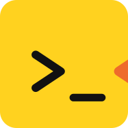

<!-- translation-source: README.md sha256=7e1a0818c86f3b17e4e6fe7541708f6b73bb55a5963967dc1a6965d7456b5bf2 -->

<p align="center">
  
</p>

# askrubberduck

[English](README.md) · [Русский](README.ru.md)

**Навыки, с которыми агент не просто говорит «готово», а показывает, почему.**

Для Claude Code, Codex, Cursor, Copilot и любого агента, который понимает Agent Skills.

Метод утёнка работает, потому что утка молчит. Объясняешь ей баг строчку за строчкой, и
где-то на четвёртой сам слышишь, в чём дело.

У твоего агента утки нет. Он говорит «готово», а кто это проверил?

Эти навыки и есть утка. Объясни цель. Покажи, как собираешься к ней идти. Запусти проверку. Утка всё
время спрашивает, где твой вывод может оказаться неверным. В том числе — нужно ли это было делать
вообще.

Твой любимый вариант проверяется так же строго, как все остальные. Вариант самой утки — тоже.

## Скажи утке

Поставь один раз и дальше пиши агенту как обычно. Нужный навык он выберет сам, по описаниям.

Пиши на своём языке; описания навыков остаются на английском.
Как выбор навыка проверяли: два прогона английских запросов и сравнение «с навыком и без» для
четырёх навыков. Подробности — в [руководстве по проверкам](evals/README.md).

| Ты пишешь | Что получаешь |
|---|---|
| «Сделай и докажи» | `duck-run`: проверит цель, составит план, сделает, попробует сломать. Остановится там, где ты разрешил; «локально» значит локально. |
| «Почему это сломалось?» | `duck-why`: причину, её подтверждение и место, где чинить, или гипотезы, которые ещё не отпали, и проверку, которая их различит. Чинить пока никто не начал. |
| «Докажи, что цель или план обоснованы» | `duck-proof`: что могло бы их опровергнуть, что проверили и что выстояло. Поблажек любимым идеям нет. |
| «Сначала продумай архитектуру» | `duck-frame`: самое простое устройство, которое выполняет контракт, с опорой на то, что уже есть. Что-то удалить — тоже вариант. |
| «Составь план» | `duck-plan`: шаги, которые можно сделать и проверить, и дешёвый эксперимент раньше дорогой догадки. То, что все согласны, не значит, что план сработает. |
| «Вычисти AI-мусор» | `duck-shape`: каждый слой должен оправдать своё существование. Лишние механизмы — под нож, контракты остаются, проверки запускаются. |
| «Упрости по-крупному» | `duck-shape`: разберёт механизм, сохранит контракты и соберёт заново так, чтобы держать в голове приходилось меньше. Потом проверит. |
| «Прогони через гейт» | `duck-review`: один вердикт, названные ревьюеры и доказательства по каждому замечанию. Утешительных призов не дают. |
| «Посмотри эту работу с разных сторон» | `duck-review`: обоснованные замечания к архитектуре, плану, документу или коду прямо в сессии. Без правок и без публикации. |
| «Эти комментарии к ревью ещё актуальны?» | `duck-review`: каждый тред сверен с тем, что ты запушил после, и к каждому — черновик ответа. Ничего не отправляется и не резолвится без тебя. |
| «Мержи», «Выпускай релиз» | `duck-land`: смержит то, что прошло гейт, проверит, что реально попало в ветку, запишет и приберёт за собой; на релизе выполнит описанный тобой процесс. Мерж без записи — работа, которую репозиторий забыл. |
| «Попробуй это сломать» | `duck-break`: реально запущенные атаки с входными данными и результатами. Представить падение — не то же самое, что уронить. |
| «Высуши комментарии» | `duck-dry`: остаётся только текст, который несёт смысл, и проверка, что под видом уборки не поменялся код. |
| «Почисти бэклог» | `duck-cut`: выкинет устаревшее, склеит дубли, разблокирует нужное. Каждая задача должна доказать, что она ещё нужна. |
| «Давай пройдёмся по моим решениям» | `duck-decide`: по одному решению за раз, варианты с ценой каждого и рекомендация. Твоё молчание ничего не решает. |
| «Что в этой ветке лишнее?» | `duck-split`: каждая часть сверена с задачей, и видно, куда отправить всё, что приехало зайцем. Перенос — отдельная просьба, и к нему прилагается доказательство, что ничего не потерялось. |
| «Что дальше?» | `duck-scan`: что можно брать, что заблокировано и почему. За спрос денег не берут. |
| «Сделай всё, что можно спланировать» | `duck-campaign`: независимые задачи, каждую из которых можно довести до релиза отдельно, и один общий список: что заблокировано и почему. |
| «Устрой гонку» | `duck-race`: две независимые попытки, одни и те же проверки результата и победитель, который выиграл честно. |
| «Разнеси это в пух и прах» | `duck-roast`: только замечания, которые выдержали проверку, что с ними делать, и раунд, у которого есть конец. |
| «Почему сессия так дорого обходится?» | `duck-diet`: измеренные потери, а не ощущения, и сокращения, после которых у агента остаётся всё нужное. |
| «Убери старые ветки» | `duck-sweep`: перед удалением проверяет, что работа сохранена; чтобы выбросить уникальную работу, нужно твоё явное решение. Не уверен — не трогай. |
| «Чему мы научились?» | `duck-learn`: уроки из сессий и итогов работы; у каждого урока одно место и одна проверка на деле, прежде чем ему доверять. |

## Установка

Агенты подхватывают навыки при старте. Как бы ты ни ставил, потом начни новую сессию.

### Claude Code

```
/plugin marketplace add askrubberduck/skills
/plugin install askrubberduck@askrubberduck
```

Или из терминала:

```bash
claude plugin marketplace add askrubberduck/skills
claude plugin install askrubberduck@askrubberduck --yes
```

Или сделай симлинки из клона в свою папку навыков — тогда навыки будут без префикса плагина:

```bash
git clone https://github.com/askrubberduck/skills ~/askrubberduck-skills
mkdir -p ~/.claude/skills
ln -s ~/askrubberduck-skills/skills/* ~/.claude/skills/
```

**Облачные сессии.** Claude Code в браузере, `claude --cloud` и routines клонируют репозиторий в
чистый контейнер и `~/.claude/` не видят. Пропиши плагин в `.claude/settings.json` репозитория —
такие плагины ставятся при старте сессии. Плагины, включённые только в твоих личных настройках, в
облако не попадают:

```json
{
  "extraKnownMarketplaces": {
    "askrubberduck": { "source": { "source": "github", "repo": "askrubberduck/skills" } }
  },
  "enabledPlugins": { "askrubberduck@askrubberduck": true }
}
```

### Codex

```bash
codex plugin marketplace add askrubberduck/skills
codex plugin add askrubberduck@askrubberduck
```

`master` не стоит на месте. Чтобы зафиксировать релиз, добавь `--ref <tag>` к первой команде.

### Cursor, Copilot, Codex IDE и любой агент, который понимает Agent Skills

Сделай симлинки из клона в общую папку, которую читают эти агенты:

```bash
git clone https://github.com/askrubberduck/skills ~/askrubberduck-skills
mkdir -p ~/.agents/skills
ln -s ~/askrubberduck-skills/skills/* ~/.agents/skills/
```

`npx skills add askrubberduck/skills` делает то же самое через CLI `skills` и сам выбирает папку
под каждого агента. Если агент читает `AGENTS.md`, но навыки сам не находит, вставь туда
[`AGENTS-CATALOG.md`](AGENTS-CATALOG.md).

Если плагин уже установлен, отдельные симлинки в тот же профиль не добавляй: агент покажет каждый
навык дважды.

### Как вызвать

| Как установлено | Что писать |
|---|---|
| Плагин Claude Code | `/askrubberduck:duck-run` |
| Плагин Codex | `$askrubberduck:duck-run` |
| Симлинки, любой агент | `/duck-run`, `$duck-run` или выбрать в списке навыков |

Внутри навыков соседний навык называется просто `duck-proof`: только такое имя понимают все
агенты.

## Знакомься с утками

| Навык | Что делает |
|---|---|
| `duck-break` | Для просьб сломать систему, проверить её на враждебных входах или испытать заявленное поведение |
| `duck-campaign` | Для просьб превратить общую цель или бэклог в независимые потоки и выполнить их |
| `duck-cut` | Для чистки бэклога, удаления устаревших задач, объединения дублей и разблокировки полезной работы |
| `duck-decide` | Для разбора решений владельца, вариантов, заблокированных обязательств и ожидающих согласования действий |
| `duck-diet` | Для аудита настройки агента, сокращения контекста и токенов, чистки инструкций и памяти, выбора моделей |
| `duck-dry` | Для сокращения лишних комментариев, докстрингов, сообщений коммитов и описаний PR; не для обычного редактирования прозы |
| `duck-frame` | Для анализа системы, уточнения требований и границ, выбора архитектуры до планирования |
| `duck-land` | Для мержа одобренной работы, выполнения процедуры релиза или записи и уборки уже влитой работы |
| `duck-learn` | Для ретроспектив, разбора сессий и результатов, извлечения уроков и улучшений навыков |
| `duck-plan` | Для планирования реализации, проверки плана, поиска важных допущений и определения критериев приёмки |
| `duck-proof` | Для доказательства необходимости, корректности или простоты, проверки плана и реализации перед ревью |
| `duck-race` | Для гонки моделей, пинг-понга по задаче, сравнения независимых реализаций и генерации враждебных тестов разными семействами моделей |
| `duck-review` | Для ревью кода, локальных изменений, PR, планов и документов, независимого вердикта, релизного гейта и ответов на полученные замечания |
| `duck-roast` | Для разноса решения целиком, повторной полной критики и аудита кодовой базы на переусложнение и лишний код |
| `duck-run` | Для работы над задачей целиком, применения выбранных замечаний, планирования, реализации и проверки |
| `duck-scan` | Для вопросов о готовых, заблокированных, открытых и оставшихся задачах или статусе репозитория без изменений |
| `duck-shape` | Для упрощения кода, удаления абстракций и лишнего, сравнения структур и проверки устройства готовой работы |
| `duck-split` | Для проверки границ задачи, извлечения посторонних изменений и разделения ветки, PR, документа или плана |
| `duck-sweep` | Для уборки старых веток, worktree, копий, временных папок и правил игнорирования |
| `duck-why` | Для диагностики сбоя или неработающего исправления, поиска автора и причины появления значения, проверки или поведения; не для обычного объяснения кода |

## На чём стоит утка

**Утка просит доказательств.** «Тесты зелёные» — это начало разговора, а не конец. Какие тесты?
Чьи требования они проверяют? На каких данных это сломается? Запускали после последней правки?
Гейт возвращает `APPROVE`, `REJECT` или `NOTE` вместе с доказательствами, которые может
перепроверить кто угодно. Уверенность в голосе ничего не стоит.

**Утка путешествует налегке.** У каждого факта одно место, у каждого правила один хозяин. Если
ради одного слоя надо открыть ещё три файла, к этому слою есть вопросы. Комментарий,
который пересказывает следующую строку, удаляется. Нужная граница остаётся, как бы ни хотелось
отчитаться удалёнными строками. Код стал короче — это ещё не значит, что стало чище.

**Утка сначала читает.** Пройди путь от входных данных до того, что реально происходит. Прочитай,
кто вызывает этот код. Найди ограничение, из-за которого появился некрасивый кусок, прежде чем
его вырезать. Пока причина — гипотеза, так её и называй. Правдоподобная история не становится
воспроизводимым сбоем оттого, что её рассказали дважды.

**Утка знает, когда остановиться.** Работу и цикл ревью ведёт агент. Ты решаешь, когда меняется
цель, объём задачи или правила. Принятые решения остаются в силе, пока не появятся новые факты.
Желание очередного ревьюера добавить ещё одну абстракцию — не факт. Никто не двигает финишную
черту только потому, что код до неё добежал.

**Утка спрашивает, прежде чем выйти за пределы твоей копии.** Коммит, push, пулл-реквест, мерж,
комментарии к ревью и закрытие тредов — каждое требует твоего разрешения; пройденное ревью его не
даёт. Так же и отправка кода модели другого вендора, удаление работы, которой больше нигде нет, и
отмена любого правила, которое проверяет гейт. Для локальных правок, о которых ты просил, второе
разрешение не нужно. Исключение — собственный конфиг утки: если `[learn].discover` оставлен в
`auto`, `duck-learn` сам ставит новую модель на испытание и вносит вердикты испытаний в
`~/.askrubberduck/config.toml`, а потом сообщает, что поменял. Поставь `propose`, чтобы он сначала
спрашивал.

## Как утка ведёт задачу

Задачу ведёт `duck-run`. Каждый этап передаёт следующему то, что можно проверить.

1. **Постановка**, `duck-frame`. Что мы потеряем, если это вообще не выпускать? Что уже решает
   задачу? Применяй `duck-shape` уже при выборе границ, пока неудачный стык не попал в план.
2. **План**, `duck-plan`. Сначала продумай путь, потом дели работу. Назови допущения и проверки,
   которые могут их похоронить. Дешёвый эксперимент — раньше дорогой догадки.
3. **Работа.** Сделай так, чтобы нужная проверка упала, потом — чтобы прошла, затем пройдись
   `duck-shape` и `duck-dry` в рамках этого изменения. «Потом упростим» — это мы уже слышали.
4. **Доказательство**, `duck-proof`. Атакуй цель, поведение и итоговое устройство. Пинг-понг
   `duck-race` с другим семейством нужен по запросу, по правилам проекта или при доказанном пробеле
   в тестировании. Где нужно, `duck-break` пытается всё сломать. Что-то поправил — перезапусти
   затронутые проверки. Вчерашний зелёный прогон сегодняшнюю правку не покрывает.
5. **Ревью**, `duck-review`. Если этого требует задача или правила релиза, независимые ревьюеры
   проверяют именно этот кандидат. Нет ревьюера — значит, нет ревью, а не
   молчаливое одобрение.
6. **Мерж**, `duck-land`. Если ты разрешил мерж: смержить, проверить, что попало в ветку,
   записать, прибраться. Просил только локальные изменения? Проверенный локальный diff и есть
   финиш.

Вокруг основного цикла: до него — `duck-scan`, `duck-cut` и `duck-decide`; всё время —
`duck-diet`; перед ревью, если в ветку или документ кто-то приехал зайцем, — `duck-split`; после —
`duck-sweep` и `duck-learn`.

## Как утка разбирает бэклог

Бэклог растёт сам. Утка сначала делает его меньше и только потом — загруженнее.

1. **Посмотреть, что есть**, `duck-scan`. Что можно брать, что заблокировано и почему — ничего не
   трогая. Бэклог лежит там, где сказано в твоих инструкциях, даже вне репозитория. Блокер,
   который никто не может подтвердить, считается неизвестным, а неизвестное брать нельзя.
2. **Поспорить с каждой задачей**, `duck-cut`. Закрыть сделанное, выкинуть то, что больше никому
   не нужно, склеить дубли, разблокировать то, что уже не заблокировано. У каждого решения есть
   доказательство. Остальное остаётся — с одной фразой о том, почему.
3. **Спросить тебя только о твоём**, `duck-decide`. По одному решению за раз: варианты, их цена и
   рекомендация. Ответ записывается до следующего вопроса.
4. **Запустить то, что осталось**, `duck-campaign`.

## Как утка ведёт кампанию

`duck-campaign` берёт большую цель, бэклог или список того, чего не хватает, и ведёт сразу много
задач. Каждая доходит до релиза, не дожидаясь остальных.

1. **Понять, что нужно**, `duck-scan` и `duck-cut`. Что открыто? Что уже решает задачу? У каких
   замечаний одна причина? Задачи «на всякий случай» уходят, пока не стали пакетом.
2. **Договориться об общем**, `duck-frame`. Общий контракт согласуется один раз, а не заново в
   каждом пакете.
3. **Сгруппировать по тому, как пойдёт работа.** Изменения с общим правилом или общей проверкой
   идут вместе. Разные владельцы, сроки релиза или риски — раздельно. У каждого пакета есть
   результат, зависимости и проверка, по которой видно, что он готов.
4. **Прогнать каждый пакет**, `duck-run`. Параллельно — только там, где работа независима. Один
   общий список показывает, что готово, что заблокировано и почему.
5. **Сначала доделать, потом начинать.** Пакет, которому осталось пройти ревью в этом же прогоне,
   важнее нового. Заблокированное ждёт с названной причиной, остальное движется дальше.

Кампания останавливается, когда разрешённая работа сделана или всё оставшееся заблокировано, и
сообщает, какая из двух причин. Твой ответ нужен только там, где решение действительно за тобой.

## Как утка упрощает код

`duck-shape` убирает то, что мешает менять код, и не теряет того, что код обязан делать. Цель —
не сделать короче, а сделать так, чтобы менять было проще.

1. **Зафиксировать, что должно выжить.** Результаты, ошибки, восстановление, публичные контракты.
   Прогнать существующие проверки до любых правок. Если у важного контракта проверки нет,
   агент добавляет проверку, которая фиксирует, как код работает сейчас.
2. **Найти, что можно убрать.** Дублирующиеся правила, мёртвые ветки и флаги, обёртки, которые
   просто передают вызов дальше, самописные замены готовых функций, проверки состояний, которых
   не бывает, тесты, повторяющие код.
3. **Решить по каждому пункту на фактах**: убрать, заменить тем, что уже есть, или оставить.
   Решают вызывающий код, контракт или сценарий сбоя. «Разделение ответственности» и «вдруг
   пригодится» не решают.
4. **Вырезать самый маленький обоснованный кусок и проверить.** Перезапустить проверки и
   попробовать реалистичное следующее изменение. Стало ли на одно правило меньше в голове и на
   одно место меньше, где живёт факт?

«Резать нечего» — тоже ответ. Если локальной уборкой неудачную границу не исправить, `duck-shape`
разбирает механизм и собирает заново так, чтобы помнить приходилось меньше. Если спросить
только, какой из двух вариантов проще, он сравнит их и ничего не будет править.

## Как утка устраивает гонку моделей

`duck-race` даёт одну задачу двум разным семействам моделей, а результат выбирают запущенные
проверки. Режимов два.

- **Гонка**: какая реализация лучше? Обе стороны решают задачу в изолированных worktree по одной
  и той же зафиксированной постановке. На обоих запускаются одни и те же проверки результата.
  Победителя выбирают факты; части объединяют, только если так лучше, и объединённое проверяют
  заново.
- **Пинг-понг**: какие крайние случаи? Одна сторона пишет один падающий тест и показывает, что он
  падает по нужной причине. Другая делает так, чтобы он прошёл, не трогая тест. Потом они
  меняются. Пинг-понг заканчивается, когда у каждого требования есть проходящий тест, исчерпан
  лимит ходов или у обеих сторон кончились идеи.

Соперник должен быть из подтверждённо другого семейства, а отправка ему кода требует твоего
разрешения. На выходе — проверенный кандидат, а не одобренный: он всё равно проходит `duck-proof`
и `duck-review`.

## Сколько уток проверяют твою работу?

Столько, сколько нужно, чтобы проверить утверждение. Толпа участников проверку
убедительнее не делает.

Узкому доказательству может хватить одной решающей самопроверки. Плану — одного независимого
критика. Гонке нужны две изолированные попытки; в пинг-понге по очереди пишут падающий тест и
исправление. Выбирай способ, который способен вскрыть ошибку, и заранее реши, где остановишься.
Если ты не задал состав сам, агент подберёт разумный; собирать комиссию под каждое изменение не
нужно.

Для релиза планка выше. По умолчанию — один ревьюер из другого семейства моделей, и это семейство
должно быть подтверждено. Для изменений, которые касаются безопасности, приватности, данных, правил
самого гейта или затрагивают скилы и файлы инструкций, — два ревьюера из разных семейств, и хотя бы
один не из того семейства, что писало код. Твои явные настройки и правила репозитория важнее.
Проверка поменьше не заменяет обязательный гейт. Если участника нет, планка от этого не опускается.
Подробности — в [правилах выбора проверки](skills/duck-review/references/challenge.md).

Отправлять твой репозиторий другому вендору можно только с твоего разрешения. Если разрешение
уже покрывает эту работу, утка его помнит. Спрашивать ещё раз — не осторожность.

Доказательства должны лежать там, где их найдут. Отдельную проверку можно описать прямо в
ответе. Если работа уходит на следующий этап, всё пишется в уже существующую запись проекта:
кандидат, проверки и открытые вопросы. Proof и break могут жить на одной странице. Гора
отчётов — ещё не доказательство.

### Где утка ведёт счёт

Кто поймал баг в прошлый раз? Утка записывает. Каждый вызов — ревьюер, соперник, критик — оставляет
одну строку в `~/.askrubberduck/dispatches.tsv`; каждое замечание после разбора — одну строку в
`~/.askrubberduck/findings.tsv`. В твой репозиторий не попадает ничего. Всё остаётся на твоей
машине, а в `~/.askrubberduck/config.toml` лежат выбранные модели и лимиты. Файла нет? Лимиты и
значения `[learn]` ниже — это значения по умолчанию, и утка работает как раньше. Модели и уровни
усилия — только пример; пока ты не назовёшь ревьюеров, их список пуст.

```toml
[families]
doer = "anthropic"
reviewers = ["openai:gpt-6-sol:high", "google:gemini-3.1-pro-high"]  # семейство:модель:усилие

[models]                    # по ролям; без списка review, race, plan берут reviewers, worker и explore — хост
review = ["openai:gpt-6-sol:high", "google:gemini-3.1-pro-high"]
race = ["google:gemini-3.8-flash-high"]
plan = ["openai:gpt-6-sol:medium"]
worker = ["anthropic:claude-sonnet-5:medium"]
explore = ["anthropic:claude-haiku-4-5:low"]

[effort]                    # по риску; перекрывает усилие модели, без него — как в модели
ordinary = "medium"
trust = "high"

[learn]
select = "fixed"            # по порядку списка; adaptive — ранжирование только ревью
discover = "auto"           # новые модели: off | propose | auto
shadow = 3                  # сколько гейтов модель на испытании идёт тенью
trial = []                  # модели на испытании; их вносит и убирает duck-learn

[bounds]                    # лимиты; внутри них, когда остановиться, решают факты
review_rounds = 3           # duck-run
trust_rounds = 2            # duck-run, безопасность, данные, правила гейта
roast_passes = 2            # duck-roast
plan_rounds = 2             # duck-plan
rally_turns = 10            # duck-race, в ходах
dispatch_timeout = "45m"    # любой фоновый вызов

[review]
default = "findings"        # что делает duck-review без уточнений

[release]
procedure = "~/notes/releasing.md"   # твой процесс релиза, вне репозитория; правила самого репозитория главнее

[repo."github.com/askrubberduck/skills"]   # настройки для одного origin; список заменяется, а не дополняется
review_rounds = 2
```

Эти записи поддерживают необязательные измерения. `skills/duck-review/scripts/ledger.py remaining <gate_id>`
 оценивает пропущенные находки по пересечению; пустых результатов недостаточно для оценки,
а общие слепые зоны ограничивают её пользу. Она не решает, когда остановить или одобрить ревью.
`precision` измеряет подтверждаемость прошлых находок, а не пропущенные дефекты. `pick <stage>`
следует порядку списка среди участников, которых требует гейт; явный adaptive ранжирует только ревью
по записанным находкам в минуту. Остальные этапы сохраняют порядок списка. Помогло ли изменение?
`paired` сравнивает два варианта на одних и тех же задачах. Что поползло? `thresholds` отдаёт случаи
`duck-learn`. Во что обойдётся этот гейт? `cost <setup>` смотрит на прошлые. Вышла новая модель?
`roster <models|->` покажет модели хоста, которых нет ни в одном списке ролей, ни на испытании, ни в
реестре; после теневых гейтов `promote` скажет, заменит ли она ревьюера своего семейства, войдёт в
список или уйдёт. Только стандартная библиотека. `-` значит «неизвестно», а
неизвестное никогда не считается нулём.

### Что уходит с твоей машины

Другой модели твоя работа уходит только через вызов. Ревьюер или соперник из другого семейства
работает через CLI своего вендора у тебя на машине: `codex` для OpenAI, `agy` для Google, `claude`
для Anthropic, под твоим аккаунтом и с твоим окружением. Его промпт, прочитанные файлы и диффы
уходят этому вендору на его условиях. `codex` может запускать команды и менять файлы в своей
песочнице. Маршрут ревью через Claude использует права режима планирования, инструменты только
для чтения файлов и отключённые MCP-серверы; пишущим соперником он быть не может. Запись в agy
без интерфейса запрещена, но остальные инструменты подчиняются его настройкам прав. Добавление
транспорта не даёт разрешения отправлять данные вендору. Своего сервера у утки нет, телеметрии тоже. `duck-learn` читает с
диска сессии Claude Code и Codex, чтобы посчитать, о чём ты просил. Всё остальное, что читает агент,
попадает в контекст модели хоста и уходит только туда, куда его и так отправляет твой хост.

### Как утка не даёт ревью тянуться вечно

Координирующий агент держит согласованные цель, ограничения и проверки на протяжении всех
раундов. Ревьюер может найти новый дефект относительно этих договорённостей. Превратить своё
свежее пожелание в новое требование — не может. У каждого замечания сохраняются причина и
доказательство, что его закрыли; если переформулировать замечание, заново оно не открывается.

Отказ отправляет к причине: в `duck-why`, если причина не видна; к постановке, если рухнуло
исходное допущение; к плану, если неудачно поделили работу; в гонку или пинг-понг, если метод раз
за разом пропускает один и тот же класс ошибок. Перед третьим раундом агент должен объяснить,
какие новые факты этот раунд даст.

По умолчанию — не больше трёх раундов ревью для обычной работы и двух для изменений
безопасности, приватности, данных или правил гейта. Если сменить ревьюеров или переименовать задачу,
счётчик не обнуляется. Дойдя до лимита, агент перестаёт отправлять работу на ревью, сохраняет
кандидат и незакрытые замечания, а релиз остаётся неодобренным. Другой лимит задаёшь ты или
правила репозитория. Никакой бесконечной погони за единогласием. Никакого «одобрим, все устали».

Пока тебя нет, технические решения в рамках задачи принимает агент. Он продолжает работу, которая
от тебя не зависит, и откладывает только то, где нужен твой ответ. Твоё молчание не выбирает
новую цель.

## Как утка доказывает свою работу

Каждый push запускает `scripts/validate-distribution.py --self-test`: манифесты разбираются,
навыки подключены, ссылки ведут куда надо, сгенерированные файлы совпадают с исходниками, а
специально внесённые поломки ловятся. Заодно он гоняет `tests/`: команды реестра и исходы вызова ревьюера
на тестовых данных, с проверкой вывода.

Это доказывает, что пакет собран правильно. Чтобы понять, делает ли утка свою работу, дай ей
задачу, где согласиться было бы ошибкой, где зелёный тест прячет баг или где ревьюер двигает
финиш. И посмотри, что она сделала на самом деле. [Руководство по проверкам](evals/README.md)
ведёт к сценариям поведения и показывает, какие из них уже прогоняли. Непрогнанный тест остаётся
непрогнанным — даже в README самой утки.

Версии и что в них поменялось — на [странице
релизов](https://github.com/askrubberduck/skills/releases).

[Участие и переводы](CONTRIBUTING.md) · [Лицензия MIT](LICENSE).
